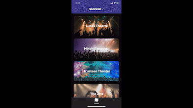

# Event-App
A React Native app designed to allow users to explore live events happening in a city of their choosing 



### Instructions for running project locally

Prerequisites:

- The [Expo CLI](https://docs.expo.dev/) must be installed on your system
- You must have access to the [SeatGeek API](https://seatgeek.com/build)

Steps:

1) Clone Repository
2) Install dependencies with `npm install` or `yarn`
3) Create a `.env` file with the following Key/Value pairs:
```
REACT_APP_SEATGEEK_CLIENT_ID=<YOUR_SEATGEEK_CLIENT_ID>
REACT_APP_SEATGEEK_CLIENT_SECRET=<YOUR_SEATGEEK_CLEINT_SECRET>
```
4) Run project with `yarn start` or `npm run start`
5) Follow instructions given in the terminal by the Expo CLI to access the application 


### Current Features

- This application pulls in event data from the [SeatGeek API](https://seatgeek.com/build). 
In order to give myself the opportuntiy to explore the API's full potential I obtained the [types for all possible query responses and all possible input parameters](https://github.com/mthomas100/Event-App/tree/master/types). Creating these types was relatively painless - I just did Postman GET request to the various API endpoints and pasted the JSON results obtained there into the [MakeTypes Generator](https://jvilk.com/MakeTypes/)

- I created a custom hook called [useSeatGeekQuery](https://github.com/mthomas100/Event-App/blob/master/hooks/useSeatGeekQuery.tsx) 
that takes the arguments of resource and params in order to query the API effectively. 

- Combining types for the API and the useSeatGeekQuery will allow for rapid and type safe building of the application while maximizing the potential out of the SeatGeek API.

### Future Features

- I plan to create a page for each venue. When it is clicked on, the user of the application will be able to browse events that are scheduled to happen at that venue. 
Each event in turn have its own page with information about the entertainer that is to play and a link to buy tickets for that event. 

- At present a few pictures downloaded from unsplash are being used in order to build an MVP of the app. It would be of interest to find a way to present actual pictures of the venues rather than these stock photos.

- Presently only the first 10 results from the SeatGeek API query appear when searching for venues in a new city. Ideally upon scrolling to the end of a set of results, the next batch of 10 results would load and then be displayed below the previous 10 results and so on. In this way a user would be able to scroll through all of the venues in their city in an intuitive fashion.

- More tabs that utilize features of the SeatGeek API in addition to a "Home" tab. 
